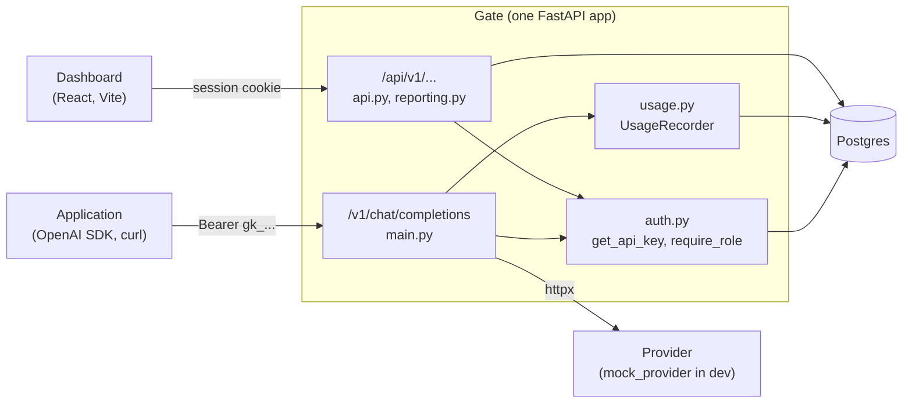

# Architecture

[Back to README](../README.md) · [API](API.md) · [Database](DATABASE.md) · [Testing](TESTING.md) · [Decisions](DECISIONS.md)

## Components

Gate is one ASGI application with two route groups:

- **The proxy** (`/v1/chat/completions`) is for programs. It authenticates with a bearer API key and returns OpenAI-shaped responses and errors.
- **The management API** (`/api/v1/...`) is for the dashboard. It authenticates with an httpOnly session cookie and returns FastAPI's usual `{"detail": ...}` errors.

Keeping the two groups' auth and error formats separate matters. An OpenAI SDK parses `{"error": {...}}`, and the dashboard's client parses `{"detail": ...}`. `errors.py` picks the format by path prefix, so a 404 on an unknown `/v1/...` route looks like OpenAI's own 404.

There are also `/healthz` (process is up, touches nothing) and `/readyz` (runs `SELECT 1` with a 2 second bound and returns 503 if the database is down).

## Source layout

| File | Responsibility |
| --- | --- |
| `src/gate/main.py` | App factory, lifespan (HTTP client, engine), proxy route, forwarding and stream relay |
| `src/gate/streaming.py` | Incremental SSE usage parser, streaming response that always runs cleanup |
| `src/gate/auth.py` | Session and API key dependencies, role checks |
| `src/gate/security.py` | argon2id password hashing, token generation, SHA-256 token hashing |
| `src/gate/usage.py` | Pricing and recording each request plus its hourly rollup |
| `src/gate/api.py` | Accounts, sessions, members, keys |
| `src/gate/reporting.py` | Request log and usage reports |
| `src/gate/pagination.py` | HMAC-signed keyset cursors |
| `src/gate/errors.py` | Error format per route group |
| `src/gate/models.py` | SQLAlchemy models |
| `src/gate/config.py` | Settings from the environment |
| `src/gate/mock_provider/` | A small OpenAI-compatible provider for development and tests |
| `src/gate/dev_seed.py` | Development data |
| `src/gate/openapi.py` | Prints the OpenAPI document the frontend's types come from |
| `frontend/` | React dashboard |

## Lifecycle of a proxied request

### 1. Authentication

`get_api_key` reads `Authorization: Bearer <key>`, hashes it with SHA-256, and selects the `api_keys` row by its unique `key_hash`. It opens its own short-lived database session instead of the request-scoped one. The request-scoped session stays open until the response finishes, and for a stream that would hold a pooled connection idle in a transaction for as long as the stream runs. A test checks that a stream in progress holds no connection.

- No header, or a key that doesn't match: `401` with `code: "invalid_api_key"`. Nothing is recorded, because a request row needs a real key and org.
- A revoked key: `401`, and the attempt is recorded against that key with status 401. It shows up in the org's request log.

There is no key cache, so revocation applies to the next request. A stream that was already authenticated runs to completion.

### 2. Validation

The body is validated against `ProxyRequest`, which requires `model` and allows `stream` and any other fields. Gate forwards the raw request bytes, not a re-serialized model, so fields Gate doesn't model (tools, `response_format`, and so on) reach the provider unchanged. Validation errors are `422` in OpenAI's shape, with `param` naming the field.

### 3. Forwarding

One `httpx.AsyncClient` is created in the app's lifespan and reused for every request, so connections to the provider are pooled. Its timeouts are 5 seconds to connect and 60 seconds for each read or write.

Non-streaming requests:

| Outcome | Client sees | Recorded status |
| --- | --- | --- |
| Provider answers (any status) | Provider's status, body, and content type | Provider's status, with usage from the body if present |
| Timeout | `504`, `type: "upstream_error"` | 504 |
| Connection or protocol error | `502`, `type: "upstream_error"` | 502 |

### 4. Streaming

For `stream: true`, `forward_stream` opens the upstream stream and waits for the first chunk before committing to a response. Up to that point, failures still produce a proper status: a non-2xx upstream response is passed through as a normal response, and a timeout or connection error before the first chunk becomes 504 or 502.

After the first chunk, the response is `200 text/event-stream` and each upstream chunk is written to the client as it arrives. `SSEUsageParser` is fed the same bytes. It buffers partial events across chunk boundaries, handles CRLF, ignores `[DONE]` and non-JSON lines, and keeps the last `usage` object it sees.

Failures after the 200 is sent:

- **Provider fails mid-stream.** Gate finishes any partial event with a blank line, then sends one final event: `data: {"error": {"message": "Upstream stream interrupted", "type": "upstream_error", ...}}`.
- **Client disconnects.** Starlette doesn't close a streaming body iterator when the client goes away. `UpstreamStreamingResponse` wraps the response in `try/finally` with a shielded cancel scope, so the upstream request is always closed. Without this the provider would keep generating, and billing, tokens nobody reads.

The request is recorded in that same cleanup step, with status 200 and whatever usage arrived. If the client left early, that is usually none.

### 5. Recording

`UsageRecorder` is created when the request starts, which fixes its `request_id` (UUIDv7) and start time. `record()` runs one transaction:

1. Look up the model's price with the latest `effective_from` at or before the request's start. No price means cost 0.
2. Compute cost in integer micros: `(prompt * input_per_1k + completion * output_per_1k + 500) // 1000`.
3. `INSERT` into `requests ... ON CONFLICT (request_id) DO NOTHING`. If nothing was inserted, stop. This makes recording idempotent.
4. Upsert the `usage_rollups` row for (key, model, hour), adding 1 request and the tokens and cost.
5. Set the key's `last_used_at` to `GREATEST(last_used_at, started_at)`, skipping revoked keys.

Token counts come only from the provider's `usage` object. Missing, negative, or non-integer counts become 0. Gate never estimates tokens.

Recording is synchronous: for non-streaming requests the write finishes before the response is returned. It is also best effort. Any exception is logged and swallowed, and `anyio.fail_after(5)` stops a slow database from holding a finished response. The trade-off is covered in [DECISIONS.md](DECISIONS.md#adr-007-record-usage-synchronously-for-now).

## Management API

Every org-scoped route starts with `require_role(minimum)`, which loads the caller's membership for the `org_id` in the path.

- Not a member, or the org doesn't exist: `404 Organization not found`. The two cases look the same, so org IDs can't be probed.
- A member below the required role: `403 Insufficient role`.

Queries after that filter by `membership.org_id`. For example, revoking a key selects it by both `id` and `org_id`, so another org's key ID is simply not found.

Changing or removing an owner locks the org's owner rows with `SELECT ... FOR UPDATE` first, so two concurrent demotions can't each see the other as the remaining owner.

## Dashboard

The dashboard is a Vite single-page app. In development Vite proxies `/api` to `127.0.0.1:8000`, so the session cookie is same-origin and needs no CORS setup.

- **Typed client.** `src/api/schema.d.ts` is generated from the backend's OpenAPI document with openapi-typescript. `openapi-fetch` uses those types, so a renamed field is a compile error. `npm run check:api` fails if the generated files are stale.
- **Server state.** TanStack Query holds all server state. Mutations invalidate the queries they affect, such as the key list after a create or revoke.
- **Session expiry.** A client middleware treats any 401 except from login as an expired session and sends the user to `/login`, returning them afterwards.
- **Pages.** Landing (`/`), sign in, register, and per org: Overview (spend chart and recent requests), Requests (filters and cursor paging in the URL), API keys, Members. Controls are hidden for roles that can't use them, and the API enforces the same rules.

## What isn't here yet

These are described in the README's [planned list](../README.md#built-and-planned). A few notes on how they'd fit:

- **Upstream credentials.** The forwarder sends only `content-type`. A provider key from settings would be added to the client's default headers in the lifespan.
- **Rate limits and budgets.** `rpm_limit` and `monthly_budget_micros` are stored per key. Enforcement would sit between authentication and forwarding, and would need a shared counter (for example Redis) once there's more than one Gate instance.
- **Async recording.** The `request_id` unique constraint already makes inserts idempotent, so a queue consumer could retry safely.
